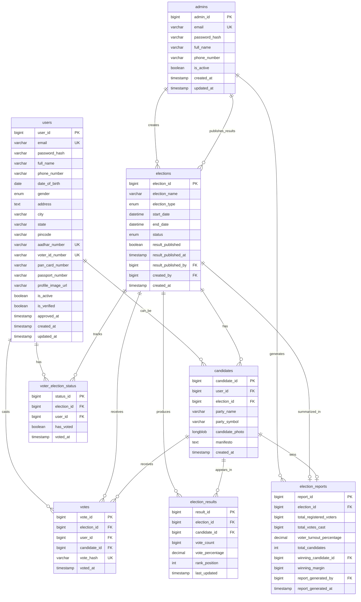

```mermaid

erDiagram    
    admins ||--o{ elections : "creates"
    admins ||--o{ elections : "publishes_results"
    admins ||--o{ election_reports : "generates"
    
    users ||--o{ candidates : "can_be"
    users ||--o{ votes : "casts"
    users ||--o{ voter_election_status : "has"
    
    elections ||--o{ candidates : "has"
    elections ||--o{ votes : "receives"
    elections ||--o{ voter_election_status : "tracks"
    elections ||--o{ election_results : "produces"
    elections ||--o| election_reports : "summarized_in"
    
    candidates ||--o{ votes : "receives"
    candidates ||--o{ election_results : "appears_in"
    candidates ||--o| election_reports : "wins"
    
    users {
        bigint user_id PK
        varchar email UK
        varchar password_hash
        varchar full_name
        varchar phone_number
        date date_of_birth
        enum gender
        text address
        varchar city
        varchar state
        varchar pincode
        varchar aadhar_number UK
        varchar voter_id_number UK
        varchar pan_card_number
        varchar passport_number
        varchar profile_image_url
        boolean is_active
        boolean is_verified
        timestamp approved_at
        timestamp created_at
        timestamp updated_at
    }
    
    admins {
        bigint admin_id PK
        varchar email UK
        varchar password_hash
        varchar full_name
        varchar phone_number
        boolean is_active
        timestamp created_at
        timestamp updated_at
    }
    
    elections {
        bigint election_id PK
        varchar election_name
        enum election_type
        datetime start_date
        datetime end_date
        enum status
        boolean result_published
        timestamp result_published_at
        bigint result_published_by FK
        bigint created_by FK
        timestamp created_at
    }
    
    candidates {
        bigint candidate_id PK
        bigint user_id FK
        bigint election_id FK
        varchar party_name
        varchar party_symbol
        longblob candidate_photo
        text manifesto
        timestamp created_at
    }
    
    votes {
        bigint vote_id PK
        bigint election_id FK
        bigint user_id FK
        bigint candidate_id FK
        varchar vote_hash UK
        timestamp voted_at
    }
    
    voter_election_status {
        bigint status_id PK
        bigint election_id FK
        bigint user_id FK
        boolean has_voted
        timestamp voted_at
    }
    
    election_results {
        bigint result_id PK
        bigint election_id FK
        bigint candidate_id FK
        bigint vote_count
        decimal vote_percentage
        int rank_position
        timestamp last_updated
    }
    
    election_reports {
        bigint report_id PK
        bigint election_id FK
        bigint total_registered_voters
        bigint total_votes_cast
        decimal voter_turnout_percentage
        int total_candidates
        bigint winning_candidate_id FK
        bigint winning_margin
        bigint report_generated_by FK
        timestamp report_generated_at
    }

```

*Visual representation of the database schema*